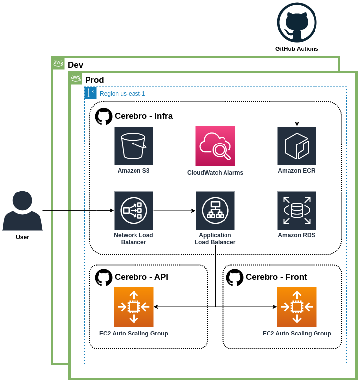

# cerebro-api

[](https://github.com/DiscoverNimbus2/cerebro-api/actions/workflows/ci.yml)
[](https://github.com/DiscoverNimbus2/cerebro-api/actions/workflows/ci.yml)
[](https://github.com/DiscoverNimbus2/cerebro-api/actions/workflows/instance_refresh.yml)

This repo contains the infrastructure that the [cerebro-infra](https://github.com/DiscoverNimbus2/cerebro-infra) depends upon.



Cloning repository from git

```sh
git clone git@github.com:DiscoverNimbus2/cerebro-api.git
```

Switch branch to dev

```sh
git checkout dev
```

Configure env files in root and cerebro folders.

Run containers.

```
docker compose up -d
```

Go to project folder.

```sh
cd ./cerebro
```

Setting storage folder.

```sh
sudo chmod 777 -R ./storage
```

Install and run npm.

```sh
npm install
npm run dev
```

Go into the container.

```sh
docker exec -it <project name>-php bash
```

Run composer install.

```sh
composer install
```

Generate laravel key.

```sh
php artisan key:generate
```

Before running the migrations, make sure that you have created all the databases that are specified in the env file.

```sh
php artisan migrate
```

Before running the tests, make sure that you have created all the databases that are specified in phpunit.xml.

Running all tests.

```sh
php artisan test
```

Running certain test.

```sh
php artisan test --filter={testName}
```

Running certain test.

```sh
php artisan test --filter={testName}
```

Running certain testsuite.

```sh
php artisan test --testsuite={testsuiteName}
```
